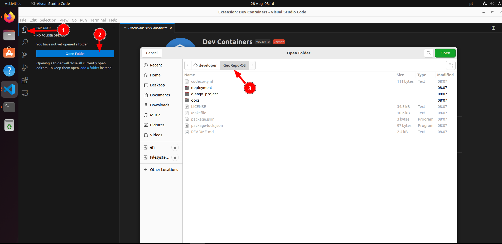
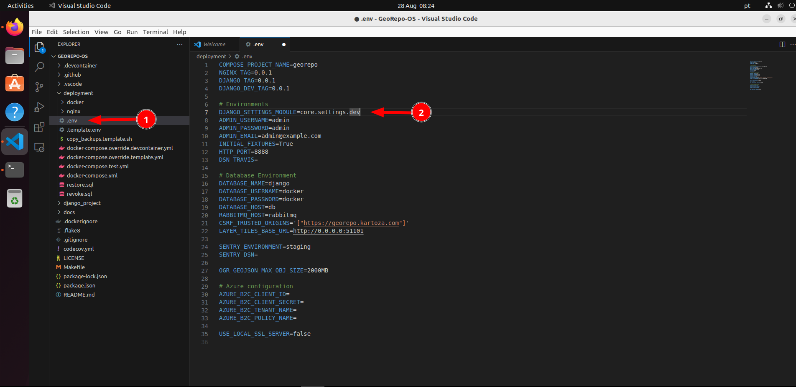

# Setting up your IDE

This section outlines the process for configuring your IDE for development.

🚩 Make sure you have gone through the [Cloning Section](cloning.md) before following these notes.
## VS Code Setup
 
Open the project in VSCode (1️⃣, 2️⃣) by navigating the the place on your file system where you checked out the code in the pre-requisites step above (3️⃣).



Accept the 'trust authors' prompt


### Copying the .env

Copy the `template.env` to `.env`

Edit the `.env` file and change the 

```
DJANGO_SETTINGS_MODULE=core.settings.prod
```
to   

```
DJANGO_SETTINGS_MODULE=core.settings.dev
```




🪧 Now that you have your IDE set up, we can move on to [building the project](building.md).
